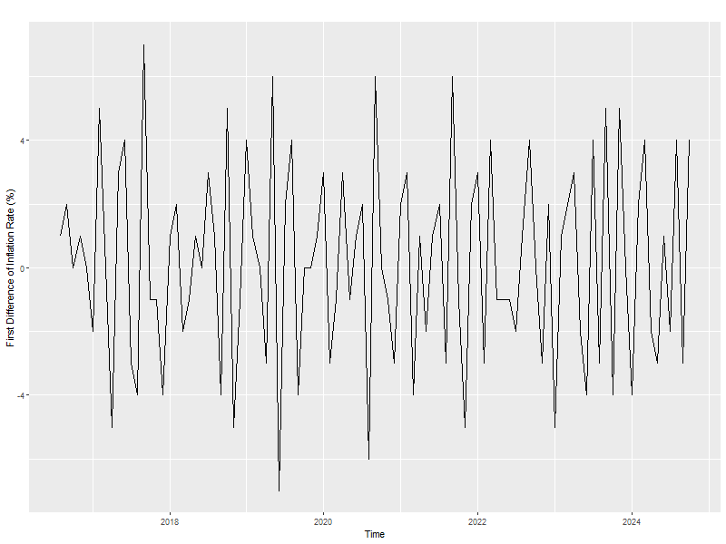
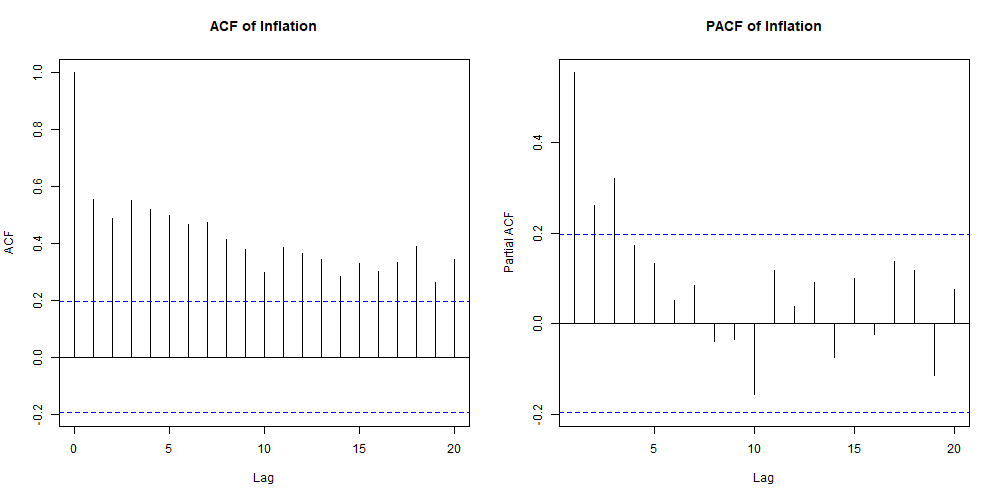
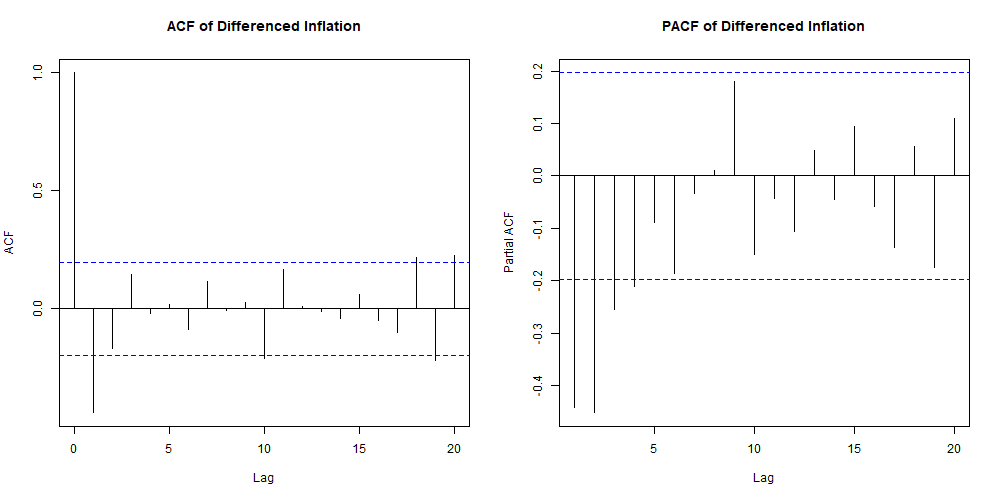
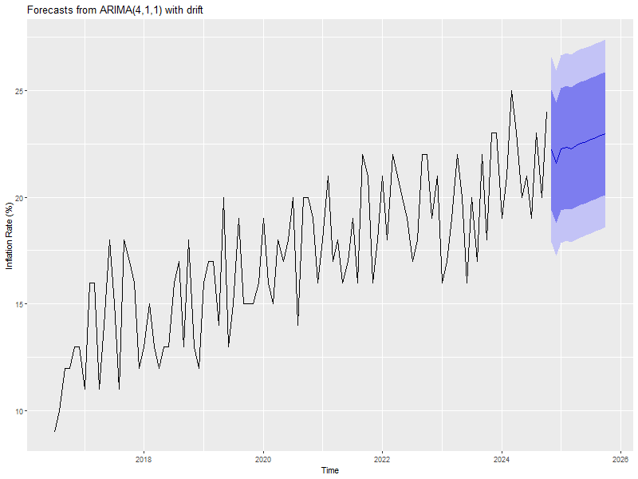

# 📈 Inflation Forecasting using ARIMA
**Author:** Shaik Mohammed

## 📘 Project Overview
This project focuses on forecasting the **Inflation Rate (%)** using **ARIMA (AutoRegressive Integrated Moving Average)** models. The analysis was carried out in **R**, applying statistical techniques to identify trends, ensure stationarity, and develop accurate predictive models. The project evaluates multiple ARIMA configurations and compares them using AIC and BIC metrics to determine the best-fitting model.

---

## 📂 Dataset & Working File

- **Dataset:** `DataInflation.csv`  
  Contains monthly **Inflation Rate (%)** data from **July 2016** onward.  
  - **Columns:**
    - `Date` - Month and year  
    - `Inflation` - Monthly inflation rate (%)
- **Main R working script:** `analysis.R`

## 🧩 Methodology

1. **Data Preparation:**
   - Monthly inflation data was imported and converted into a time series object starting from **July 2016** with a frequency of **12 (monthly)**.
   - The original time series showed a clear **upward trend**, indicating persistent growth with no signs of levelling off. There are regular fluctuations that suggest potential seasonality, while the variance remains relatively constant throughout the series. The presence of a clear trend suggests that the series is **non-stationary**, with a non-stationary mean.
     

       
     

3. **Differencing:**
   - First-order differencing was applied to remove the trend and stabilize the mean.
   - The differenced series showed stationarity with fluctuations centered around zero.
     

       
     

5. **ACF and PACF Analysis:**
   - The **ACF** of the original series displayed a slow decay with significant values up until lag 20, indicating the importance differencing in order to achieve stationarity.
     

       
     

   - After differencing, the **ACF** showed a cutoff after lag 1 and the **PACF** after lag 4. A suitable model for the data would be **ARIMA (4, 1, 1)**. This accounts for the trend removal through 
**differencing** (d = 1), four **autoregressive terms** (p = 4), and one **moving average** term (q = 1).
     

       
     

6. **Model Fitting:**
   - Three models were estimated:
     - **ARIMA(4,1,1)** with drift (from our analysis) 
     - **ARIMA(2,1,5)** with drift (suggested by a colleague)
     - **Auto ARIMA** (automatically selected based on information criteria)

7. **Model Comparison:**
   | Model | AIC | BIC | Result |
   |--------|-----|-----|---------|
   | ARIMA(4,1,1) | 449.92 | 468.09 | Best fit |
   | ARIMA(2,1,5) | 451.76 | 475.12 | Comparable performance |
   | Auto ARIMA | 459.61 | 475.18 | Slightly worse |

   The **ARIMA(4,1,1)** model achieved the lowest AIC and BIC, making it the most suitable for forecasting inflation.

8. **Forecasting:**
   - A **12-month forecast** was generated using the preferred ARIMA(4,1,1) model.
   - The plot in below shows the forecasted inflation rate (%) for the next 12 months based on the **ARIMA (4,1,1)** model with drift, with a 95% confidence interval shaded in blue. The solid line represents the forecasted mean, which continues **the upward trend in inflation from which we can say that the Inflation rate is only going to go higher** in the coming time. The variance appears relatively constant over the forecast period.
   

     
   

---

## 📊 Results Summary

- The inflation data exhibited **non-stationarity**, which was successfully corrected through first-order differencing.
- Model diagnostics confirmed **ARIMA(4,1,1)** as the best model.
- Forecasting results show a **steady increase in inflation**, aligning with the observed historical trend.
- All analysis and visualizations (time series, ACF/PACF plots, and forecasts) are saved as `.png` files in the project directory.

---

## 🧰 Tools & Libraries
- **R**  
- Packages: `forecast`, `ggplot2`, `stats`, `Rcpp`

---

## Output Visualisations
- `Inflation_Series.png` - Original inflation time series  
- `Differenced_Inflation.png` - Stationary series after differencing  
- `ACF_PACF_Inflation.png` - ACF & PACF plots of original series  
- `ACF_PACF_Differenced.png` - ACF & PACF plots of differenced series  
- `Forecast_ARIMA_411.png` - 12-month forecast plot  
